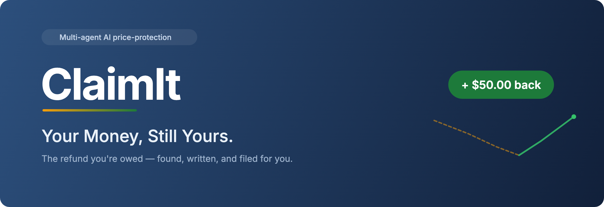
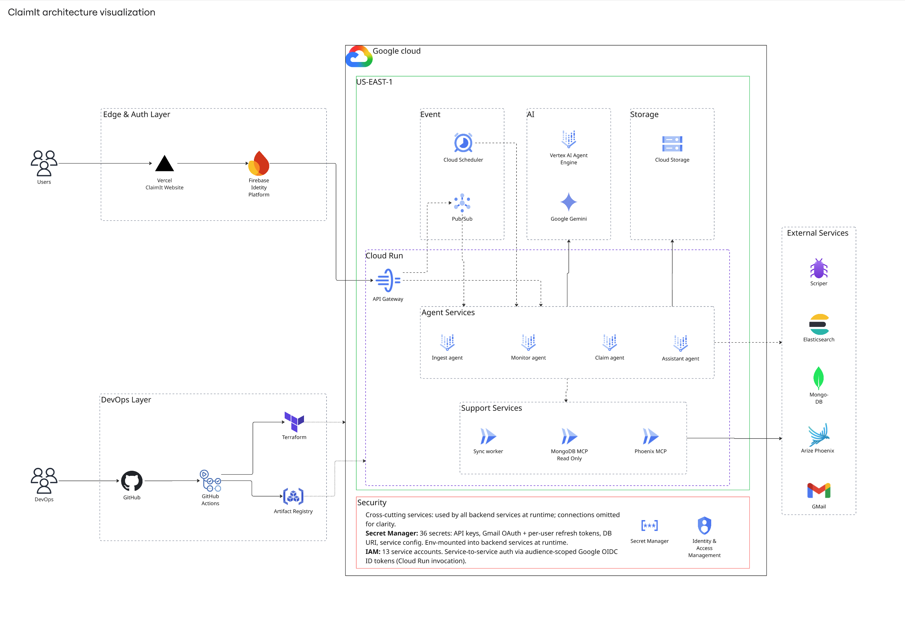

<div align="center">



<p>
  &nbsp;&nbsp;
  &nbsp;&nbsp;
  &nbsp;&nbsp;
  &nbsp;&nbsp;
  &nbsp;&nbsp;
  &nbsp;&nbsp;
  &nbsp;&nbsp;
  &nbsp;&nbsp;
  &nbsp;&nbsp;
  
</p>

<p>
  <a href="https://youtu.be/nIhkDO9LUsA"></a>
  &nbsp;
  <a href="https://claimitai.vercel.app/"></a>
  &nbsp;
  <a href="docs/"></a>
</p>

</div>

**You bought something. The price dropped. You deserve a refund.**

ClaimIt is a multi-agent AI system that automates post-purchase price-match refunds. It monitors prices across retail, airline, and hotel platforms, detects refund eligibility under each platform's own policy, and generates the exact claim material the platform requires — email, chat script, in-store guide, or self-service walkthrough. For email claims, it can send directly from your Gmail after approval.

> **Current submission**: [Google Cloud Rapid Agent Hackathon](https://rapid-agent.devpost.com/?ref_feature=challenge&ref_medium=discover) — Agent Builder + Gemini track, MongoDB MCP partner integration.

---

## Why ClaimIt Exists

Nearly every major retailer, airline, and hotel will refund you when the price drops after you buy, but almost no one ever claims it. Industry estimates put unclaimed price-protection refunds in the U.S. at **$10B+ a year**. The refunds are legitimate; the process is just too fragmented to run by hand — claim windows run from ~14 days (retail) to as little as 24 hours (hotels), and every platform demands a different submission format.

ClaimIt automates the watching, the policy interpretation, and the writing — and handles submission where the platform allows it.

---

## How It Works

1. **Ingest** — Gemini parses purchase receipts from Gmail or uploads into structured data
2. **Monitor** — Prices tracked on a cadence-aware schedule (6h → 1h → 15min as windows close), with screenshot evidence at every check. Product URLs are auto-resolved from receipt data when missing
3. **Draft** — Claim materials generated in the format each platform actually accepts, self-evaluated by Gemini before surfacing to the user
4. **Approve** — Three-pane review UI: draft + evidence + AI assistant. Edit if needed, then approve
5. **Submit** — Email claims sent from your Gmail after approval. Other types provide copy-ready scripts, printable guides, or step-by-step walkthroughs

| Output Type | On Approve | Example Platforms |
| --- | --- | --- |
| **Email** | Sent from your Gmail after approval | Best Buy, Delta, Hilton |
| **Chat Script** | Copy messages into live chat | Amazon, Target |
| **In-Store Guide** | Print and bring to the store | Target, Home Depot |
| **Self-Service Walkthrough** | Follow step-by-step instructions | Southwest, United |

→ [Claim Output Types](docs/reference/claim_output_types.md)

---

## Tech Stack & MCP Integrations

### Core Technologies

| Layer | Technologies |
| --- | --- |
| **AI** | Google Cloud Agent Builder · Gemini · Vertex AI |
| **Data** | MongoDB Atlas · Elasticsearch |
| **Events** | Google Cloud Pub/Sub · Cloud Scheduler |
| **Compute** | Google Cloud Run (8 services) |
| **Frontend** | Next.js · TypeScript · Tailwind CSS · shadcn/ui |
| **Backend** | Python · FastAPI · Pydantic v2 |
| **Auth** | Firebase Authentication · Gmail OAuth 2.0 |
| **Observability** | Arize Phoenix · OpenTelemetry |
| **Infra** | Terraform · GitHub Actions |

→ [Tech Stack Details](docs/reference/tech_stack_details.md)

### Three MCP Integrations

Agents access external systems through the Model Context Protocol. Each MCP is fronted by Gemini-safe `FunctionTool` wrappers — raw MCP schemas use `const`/`oneOf` constructs that Gemini rejects, so each tool is wrapped with a simple, parseable signature. Auth is injected via httpx request event hooks (Agent Engine silently drops client-level auth).

| MCP | Purpose | Transport | Agents |
| --- | --- | --- | --- |
| **MongoDB** | Exact-match policy lookup by platform name | Streamable HTTP → Cloud Run (OIDC) | All four agents |
| **Phoenix** | Read OTel traces and spans — explain claim reasoning, surface self-eval scores | stdio→HTTP bridge → Cloud Run (OIDC) | All four (claim reasoning: Assistant + Claim) |
| **Elastic** | Full-text policy search across all platforms | Streamable HTTP → Kibana (ApiKey) | Assistant only |

MongoDB MCP handles precise, named-platform lookups (`search_platform_policy("best_buy")`). Elastic MCP complements it with broad, natural-language search (`search_policies_fulltext("return window electronics")`). Phoenix MCP lets the Assistant explain *why* a claim was drafted the way it was by reading the Gemini call traces.

Tenancy is enforced in the wrapper layer — collection/filter constraints are hard-coded, not model-controlled. Secrets are read from environment at request time, never baked into cloudpickle or Terraform state.

→ [MCP Integrations](docs/reference/mcp_integrations.md)

---

## Architecture

Four AI agents collaborate through a Google Cloud Pub/Sub event bus. Each agent has a single responsibility. No agent calls another directly — they communicate exclusively through events.



| Agent | Responsibility |
| --- | --- |
| **Ingest** | Receipt parsing via Gemini; Gmail watch integration; low-confidence extractions trigger human confirmation |
| **Monitor** | Cadence-aware price surveillance with screenshot evidence capture; auto-resolves product URLs from receipt data via ScraperAPI when missing |
| **Claim** | Four output types; Gemini self-critique on clarity, tone, accuracy, completeness; Gmail Send API for email claims |
| **Assistant** | **Mode A**: general help · **Mode B**: claim-scoped with full context, tool access, and reasoning trace visibility. Invoked through the API Gateway and grounded in claim context plus trace metadata |

→ *[Architecture](docs/reference/architecture.md)*

---

## MongoDB Atlas as Shared Context Layer

MongoDB Atlas stores the full claim lifecycle across six collections, accessed by agents through MCP tool calls:

| Collection | Purpose |
| --- | --- |
| `users` | Accounts, Gmail OAuth state, send-mode preferences |
| `purchases` | Extracted purchase records with confidence scores and resolved product URLs |
| `price_history` | Timestamped price observations with evidence references |
| `policies` | Platform refund policies — windows, exclusions, submission channels |
| `claims` | Draft versions, approval history, submission state, outcomes |
| `conversations` | Assistant chat threads and agent session references |

→ [Data Model Reference](docs/reference/data_model_reference.md)

---

## Technical Highlights

- **Event-driven multi-agent orchestration** on Google Cloud Agent Builder with Pub/Sub — agents scale and fail independently
- **Three MCP integrations** (MongoDB, Phoenix, Elastic) with Gemini-safe wrappers, event-hook auth, and wrapper-level tenancy enforcement
- **Four distinct claim output types** matched to real platform submission processes, not generic templates
- **Gemini self-evaluation loop** grades drafts on a rubric before surfacing them to users
- **Recursive observability** via Arize Phoenix — the Assistant queries Phoenix to explain claim decisions, and that query is itself traced
- **Gmail integration** for both inbound receipt detection and outbound claim sending from the user's own mailbox

---

## Platform Coverage

**26 platforms** across three categories (24 with active price-protection policies):

| Category | Platforms |
| --- | --- |
| **Retail** (15) | Best Buy · Target · Dick's · JCPenney · Staples · Macy's · Nordstrom · Newegg · Costco · Dell · Home Depot · Lowe's · Crutchfield · ~~Amazon~~ · ~~Walmart~~ |
| **Airlines** (6) | Southwest · Delta · United · JetBlue · Alaska · American |
| **Hotels** (5) | Hilton · Marriott · Hyatt · IHG · Wyndham |

Two platform (Best Buy and Target) run fully live end-to-end. Amazon and Walmart are tracked but currently inactive (no post-purchase price-match program). The remaining use source-linked policy fixtures and seeded data to demonstrate scalable coverage. Adding a new platform requires only a policy document and a price-check adapter.

→ [Platform Coverage](docs/reference/platform_coverage.md)

---

## Security & Privacy

- Gmail OAuth is configured to request only the scopes needed for receipt detection and claim sending — see [Security Model](docs/reference/security_model.md)  for the full scope list
- OAuth tokens stored in Google Cloud Secret Manager, not in application databases
- No email is ever sent without explicit user approval (or a user-configured auto-send with 5-minute cancellation window)
- MCP tool wrappers enforce tenancy at the code level — the model cannot pivot queries to other users' data
- Current deployment is single-tenant; multi-tenant isolation is planned

→ [Security Model](docs/reference/security_model.md)

---

## Limitations

- **2 of 26 platforms** run live end-to-end; the remaining 24 use source-linked policy fixtures with simulated price monitoring
- **Outcome tracking** is manual — users report whether the merchant approved or denied the claim
- **Per-user quotas** for Gemini calls and scraper requests are designed but not yet enforced
- **Gmail connection is invite-only.** ClaimIt's Google OAuth app is still in Google's "Testing" status (sensitive Gmail scopes require Google verification before public release), so only allowlisted test users can link their mailbox up to Google's 100-test-user cap. To try the Gmail receipt-detection and claim-sending features, contact the ClaimIt team to be added as a test user first.

---

## Future Plans

**Full live coverage** — extend real end-to-end monitoring from Best Buy to all 24 platforms

- **Open Gmail to everyone** — complete Google OAuth verification to remove the invite-only test-user limit
- **Close the loop** — auto-redraft on low self-eval scores and automate outcome tracking (today it's manual)
- **Scale out** — multi-tenant isolation, then a browser extension and mobile app for receipt capture

---

## Getting Started

### Prerequisites

Install once on your machine (skip if already present):

- **Node 20 + pnpm 9** via [volta](https://volta.sh):

  ```bash
  brew install volta
  volta install node@20 pnpm@9
  ```

- **Python tooling** via [uv](https://docs.astral.sh/uv/):

  ```bash
  brew install uv
  ```

### One-command setup

After cloning, run:

```bash
git clone https://github.com/claimit-team/claimit
cd claimit
./scripts/setup.sh
```

This:

- Verifies Node, pnpm, uv versions
- Runs `pnpm install` (postinstall hook auto-installs pre-commit)
- Sets up git hooks
- Validates everything works

**Working on Python agents?** Add `--with-python` to install all 4 agents (~300MB):

```bash
./scripts/setup.sh --with-python
```

Or sync individual agents on demand:

```bash
cd apps/ingest-agent && uv sync
```

### Daily workflow

```bash
# After git pull, just run pnpm install — postinstall hook handles pre-commit
pnpm install
```

### Running services locally

```bash
# Frontend (port 3000)
pnpm --filter web dev

# Backend services (one per terminal)
cd apps/api-gateway     && uv run uvicorn src.main:app --reload --port 8005
cd apps/ingest-agent    && uv run uvicorn src.main:app --reload --port 8001
cd apps/monitor-agent   && uv run uvicorn src.main:app --reload --port 8002
cd apps/claim-agent     && uv run uvicorn src.main:app --reload --port 8003
cd apps/assistant-agent && uv run uvicorn src.main:app --reload --port 8004
cd apps/sync-worker     && uv run uvicorn src.main:app --reload --port 8006
```

### Local end-to-end development

The frontend and every backend service read config from a `.env.local` file in
their respective app directory. `scripts/fetch_env.sh` pulls the values out of
Google Secret Manager and assembles a ready-to-go `.env.local`, so any teammate
with `gcloud` access can run the full stack locally without merging to test.

See **[docs/local-testing.md](docs/local-testing.md)** for the full walkthrough
(troubleshooting, mode switching, known limitations). TL;DR below.

> ⚠️  **Everything below talks to PROD `claimit-beta`.** There is no
> separate dev environment. Mongo writes are real, Anthropic spend is real,
> Firebase users are real, and outbound Gmail sends are real. Don't trigger
> destructive flows (claim send, account changes) unless that's the intent.

**One-time setup**

```bash
gcloud auth login                          # Secret Manager access
gcloud auth application-default login      # ADC for Firebase Admin / Vertex / Pub-Sub
gcloud config set project claimit-beta
```

Verify your account has `roles/secretmanager.secretAccessor` on `claimit-beta`.
Also confirm `localhost` is in the Firebase Console's **Auth → Settings →
Authorized domains** list — without it Google sign-in fails with
`auth/unauthorized-domain`.

**Fastest path: local frontend against the deployed BFF**

```bash
./scripts/fetch_env.sh web                 # writes apps/web/.env.local
pnpm --filter web dev                      # http://localhost:3000
```

This unblocks the Vercel-CD bottleneck for any FE-only change. The deployed
api-gateway already whitelists `http://localhost:3000` in CORS, so no infra
change is needed.

**Full local stack (FE + any subset of backend)**

Fetch envs for whichever services you want to run locally:

```bash
./scripts/fetch_env.sh api-gateway
./scripts/fetch_env.sh assistant-agent
# ...repeat for ingest-agent / monitor-agent / claim-agent / sync-worker
```

Then start the services with the existing `uv run uvicorn` commands. When
running api-gateway locally, point the frontend at it:

```bash
./scripts/fetch_env.sh web --force --local-backend
```

Use `--force` to overwrite an existing `.env.local`.

---

## Team

| Name | Role | Focus |
| --- | --- | --- |
| **Erdun E** | PM · Frontend | Product direction, Next.js UI, demo production |
| **Raj Kavathekar** | Agent AI Engineer | Ingest Agent, Monitor Agent, Assistant Agent, data pipelines |
| **Kewen Chen** | Agent AI Engineer | Claim Agent, prompt engineering |
| **Qingyuan Wan** | Backend · Infrastructure | API Gateway, shared packages, Terraform, CI/CD, MCP integrations |

---

## Links

- **Live app** — [claimitai.vercel.app](https://claimitai.vercel.app/)
- **Demo video** — [YouTube](https://youtu.be/nIhkDO9LUsA)
- **LinkedIn** — [linkedin.com/company/claimitai](https://www.linkedin.com/company/claimitai)
- **X** — [@claimitbeta](https://x.com/claimitbeta)

---

## Credits

Background music sourced from [Pixabay Music](https://pixabay.com/music/):
- "Corporate" by Sigmamusicart ([track #537730](https://pixabay.com/music/search/537730/))
- "Upbeat Happy Corporate" by Kornevmusic ([track #487426](https://pixabay.com/music/search/487426/))

Both used under [Pixabay Content License](https://pixabay.com/service/license-summary/).

---


## License

Proprietary License
