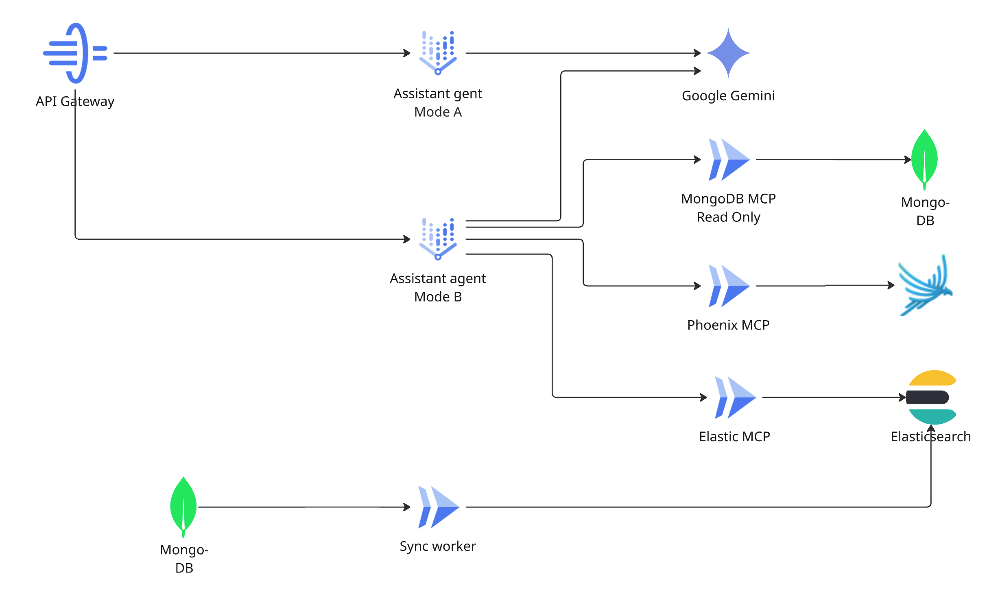

# Assistant Agent

The Assistant Agent is ClaimIt's conversational AI layer. It operates in two modes — general help across the system (Mode A) and deep, claim-focused reasoning with tool access (Mode B). It is the only agent that users interact with directly through the chat interface.

---

## Two Modes

|  | Mode A — General | Mode B — Claim-Focused |
| --- | --- | --- |
| **Scope** | System-wide — can discuss any purchase, claim, or platform | Single claim — all context and tools are scoped to one specific claim |
| **Invocation** | Vertex AI Agent Engine SDK (`async_stream_query`) | Direct HTTP POST to Cloud Run (`/internal/mode-b/stream`) |
| **Session** | Persistent session via Agent Builder (`agent_session_id` stored in MongoDB) | Ephemeral per-request (`InMemorySessionService` with a fresh UUID) |
| **Entry point** | User opens the Assistant page or general chat | User opens the Assistant pane on a claim detail page |
| **Tools** | MongoDB MCP (policy lookup), Phoenix MCP (trace summary), Elastic MCP (fulltext search) | All Mode A tools + claim context loader + redraft requester + reasoning trace reader |

---

## Mode B — Claim-Focused

Mode B is the primary interaction point for claim review. When the user opens the Assistant pane on a claim detail page, Mode B activates with the claim's full context pre-loaded.

### Available Tools

| Tool | Source | What It Does |
| --- | --- | --- |
| `get_claim_context` | Direct MongoDB query | Loads the claim document, associated purchase, policy, and latest draft content |
| `request_redraft` | Pub/Sub publisher | Publishes `claim.redraft_requested` with user feedback → Claim Agent regenerates |
| `get_reasoning_trace` | Phoenix MCP | Reads OTel spans for this claim — validator results, self-eval scores, Gemini call traces |
| `search_platform_policy` | MongoDB MCP | Looks up the platform's refund policy by name |
| `search_policies_fulltext` | Elastic MCP | Full-text search across all platform policies |
| `get_recent_trace_summary` | Phoenix MCP | Sanitized summary of recent spans — counts by name and status |

### Proactive Quick Actions

The claim detail page offers pre-built prompts as buttons below the chat:

- **"Make it friendlier"** → triggers `request_redraft` with tone feedback
- **"Why this template?"** → Agent uses `get_claim_context` + `get_reasoning_trace` to explain the choice
- **"Explain the policy match"** → Agent reads the policy and explains eligibility
- **"Switch to manual approval"** → Agent updates the claim's send preference

### Context Grounding

Mode B responses are grounded in claim-specific data, not general knowledge. The Agent is invoked through the API Gateway, which provides:

- The full claim document (draft content, version history, outcome state)
- The associated purchase record (product, price, dates, platform)
- The platform's refund policy (window, exclusions, submission channel)
- Conversation history (previous messages in this thread)
- OTel trace metadata from Phoenix (when available)

---

## Streaming Architecture

Both modes stream responses to the frontend as Server-Sent Events:

```
Frontend ── POST /conversations/:id/messages ──▶ API Gateway
                                                     │
                                              ┌──────▼──────┐
                                              │ Mode A: SDK  │
                                              │ Mode B: HTTP │
                                              └──────┬──────┘
                                                     │
                                              SSE event stream
                                              (text_chunk, tool_call,
                                               tool_result, done)
                                                     │
                                                     ▼
                                                 Frontend
                                              renders in real-time
```



### SSE Event Types

| Event | Data | Purpose |
| --- | --- | --- |
| `text_chunk` | `{"text": "..."}` | Incremental response text |
| `tool_call` | `{"tool": "...", "input": {...}}` | Agent is invoking a tool |
| `tool_result` | `{"tool": "...", "output_summary": "..."}` | Tool returned a result |
| `done` | `{"trace_id": "..."}` | Stream complete; includes OTel trace ID for Phoenix deep link |

### Trace Linking

The `done` event includes a `trace_id` — the OTel trace ID from the `mode_b.stream` wrapping span. This span is the parent of all child spans (Gemini calls, MongoDB queries, tool invocations) created during the request. The frontend renders a "View trace" link that opens the full trace in Phoenix.

For Mode A (Vertex AI SDK), the gateway creates a manual span as a fallback trace ID source, since the SDK does not expose its internal trace context.

---

## Pub/Sub Events

| Direction | Event | Trigger |
| --- | --- | --- |
| **Publishes** | `claim.redraft_requested` | User asks to refine a draft via Mode B |

The Assistant Agent is the only agent that publishes but does not subscribe to any topic. It is invoked synchronously by the API Gateway, not by Pub/Sub events.

---

## MCP Tool Routing

The Assistant uses prompt-level guidance to route between MongoDB and Elastic for policy queries:

- **Named platform** (e.g., "What's Best Buy's return policy?") → `search_platform_policy` via MongoDB MCP (exact match)
- **Broad or fuzzy query** (e.g., "Which platforms allow price matching on electronics?") → `search_policies_fulltext` via Elastic MCP (full-text search)
- **Fallback**: If one source returns empty, the Agent is instructed to try the other

Phoenix MCP tools are used when the user asks about claim reasoning:

- **"Why was my claim scored low?"** → `get_reasoning_trace` reads the `self_evaluate.evaluate` span for this claim
- **"Show me recent traces"** → `get_recent_trace_summary` returns sanitized counts (span names + status codes only, no cross-user content)

---

## Graceful Degradation

| Failure | Behavior |
| --- | --- |
| Phoenix MCP bridge unreachable | Mode B answers from claim-document context; sets `phoenix_query_status: timeout` or `unavailable` |
| Elastic MCP search failure | Returns `{"error": "search_unavailable"}`; Agent falls back to MongoDB exact lookup |
| MongoDB MCP failure | Agent responds with available context; does not hard-fail |
| Gemini rate limit or error | SSE stream emits a `done` event with `{"error": "..."}` |

---

## Key Files

| Path | Role |
| --- | --- |
| `apps/assistant-agent/src/main.py` | FastAPI app, Mode B streaming handler (`_stream_mode_b`), OTel span wrapping |
| `apps/assistant-agent/src/mode_a.py` | Mode A agent definition and tool registration |
| `apps/assistant-agent/src/mode_b.py` | `handle_message` — Mode B agent execution with tool routing |
| `apps/assistant-agent/src/proactive_prompts.py` | Proactive notification prompt templates |
| `apps/assistant-agent/src/tools/claim_tools.py` | `get_claim_context`, `request_redraft`, `get_reasoning_trace` |
| `apps/assistant-agent/src/tools/search_tools.py` | MongoDB and Elastic MCP search tool wrappers |
| `apps/api-gateway/src/services/conversation_service.py` | Mode A/B routing, session management, SSE frame assembly |
| `apps/api-gateway/src/services/mode_b_client.py` | HTTP client for Mode B with OIDC auth |

---

→ Back to [Architecture](architecture.md)
