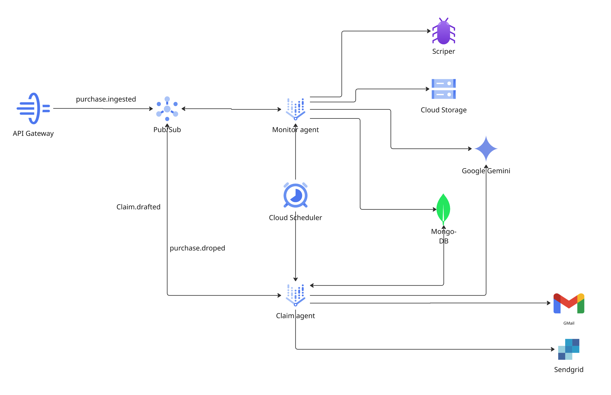

# Claim Agent

The Claim Agent generates, evaluates, and submits price-match claim materials. It subscribes to three Pub/Sub topics and produces one of four output types matched to each platform's actual submission process.

---

## Responsibilities

1. **Draft generation** — Produce claim materials in the correct format for the target platform
2. **Output validation** — Check for placeholder tokens, ID mismatches, and prohibited language
3. **Self-evaluation** — Gemini grades its own drafts on a rubric before surfacing them to users
4. **Submission** — Send email claims via Gmail API; mark non-email claims as ready for user action
5. **Redraft** — Regenerate drafts incorporating user feedback from the Assistant Agent

---

## Pub/Sub Events

| Direction | Event | Trigger |
| --- | --- | --- |
| **Subscribes** | `price.dropped` | Monitor detects an eligible price drop → Claim Agent generates a draft |
| **Subscribes** | `claim.approved` | User approves a claim (or auto-send fires) → Claim Agent submits |
| **Subscribes** | `claim.redraft_requested` | Assistant Agent forwards user feedback → Claim Agent regenerates |
| **Publishes** | `claim.drafted` | Draft is ready → notification sent to frontend |

---

## Four Output Types

Each platform accepts claims differently. The Claim Agent selects the output type based on the platform's `submission_channel` field in the policy document.

| Type | Format | Gemini Prompt Strategy | Example |
| --- | --- | --- | --- |
| **Type A — Email** | Subject line + formatted body with policy citations and refund calculation | Formal business letter tone; must include order ID, price evidence, policy reference | Best Buy |
| **Type B — Chat Script** | Numbered steps, each a single chat message | Conversational but direct; each step is self-contained so the user can copy one at a time | Target |
| **Type C — In-Store Guide** | Sections: What to Say, What to Bring, Talking Points, Policy Reference, If Denied | Concise and actionable; designed to be printed or shown on a phone | Home Depot |
| **Type D — Self-Service Walkthrough** | Numbered click-by-click instructions with platform URLs and form field values | Precise and literal; references specific UI elements on the platform's website | Southwest |

### Field Insertion

Gemini writes only placeholder tokens (e.g., `{{ORDER_ID}}`, `{{REFUND_AMOUNT}}`). Python handles all programmatic field insertion after generation. This prevents Gemini from hallucinating order IDs or dollar amounts.

→ *See [Claim Output Types](claim_output_types.md)  for full format specs and example outputs*

---

## Draft Pipeline

```
price.dropped event received
    │
    ▼
Load claim + purchase + policy from MongoDB
    │
    ▼
Select output type from policy.submission_channel
    │
    ▼
Generate draft via Gemini (type-specific prompt)
    │
    ▼
Validate output (4 checks, all issues collected — no short-circuit)
  - No unreplaced placeholder tokens (`{{...}}` regex)
  - Order ID matches purchase record
  - No prohibited phrases: sue you, take legal action, file a lawsuit,
    small claims court, attorney, lawyer, stupid, idiot, incompetent,
    social security, credit card number, password
  - Refund amount plausibility: flags if draft amount differs from
    claim amount by more than 10× (REFUND_TOLERANCE_FACTOR)
    │
    ▼
Self-evaluate via Gemini (rubric scoring)
  - Clarity, Tone, Accuracy, Completeness
  - Each dimension scored 0–10
  - Pass threshold: all dimensions ≥ 7
    │
    ▼
Store draft version in claims collection
    │
    ▼
Publish claim.drafted → frontend notification
```

---



## Self-Evaluation

After generating a draft, the Claim Agent asks Gemini to evaluate its own output against a rubric:

| Dimension | What It Measures |
| --- | --- |
| **Clarity** | Is the request unambiguous? Can the recipient understand exactly what is being asked? |
| **Tone** | Is the language professional and appropriate? No threats, no excessive formality |
| **Accuracy** | Are all facts correct — prices, dates, order IDs, policy references? |
| **Completeness** | Does the draft include everything needed for the platform to process the claim? |

Each dimension is scored 0–10. Pass threshold: every dimension must score **≥ 7** — a single dimension below 7 fails the evaluation. The self-evaluation result is stored on the draft version and traced in Phoenix via the `self_evaluate.evaluate` span with attributes including `self_eval.passed`, `self_eval.total_score`, and per-dimension scores.

---

## Submission Flow

When a `claim.approved` event arrives:

1. **Load claim** — Fetch the latest draft from MongoDB
2. **Guard checks** — Skip if `submitted_via` is already set (idempotency) or if `outcome` is not `pending`
3. **Submit by type**:
    - **Email**: Send via Gmail API from the user's connected account. Write `submitted_via: gmail` and `gmail_message_id` to the claim document
    - **Chat Script / In-Store / Self-Service**: Mark as submitted. No outbound action — the user handles the actual submission using the generated materials
4. **On success**: Write `outcome: pending`, publish notification
5. **On failure**: Roll back `outcome` to `draft_pending`, write error details to `outcome_note`

### Auto-Send Queue

Users can configure auto-send mode. When enabled:

- New email claims go directly to `queued_for_send` status with a 5-minute timer
- The frontend shows a countdown with Cancel / Send Now options
- If not cancelled, the claim transitions to `claim.approved` automatically
- Non-email claim types are never auto-sent — they always require manual approval

---

## Redraft Flow

When the Assistant Agent forwards a redraft request (`claim.redraft_requested`):

1. Load the current draft and the user's feedback text (1–500 characters)
2. Re-run the draft pipeline with the feedback appended to the Gemini prompt as revision instructions
3. Store as a new draft version (version number increments)
4. Publish `claim.drafted` to notify the frontend of the updated draft

The user can trigger multiple redraft cycles. Each version is preserved in the `draft_versions` array on the claim document.

---

## OTel Spans

The Claim Agent emits two custom spans to Phoenix:

| Span Name | Attributes |
| --- | --- |
| `validator.validate` | `claim.id`, `claim.type`, `draft.version`, `validator.issue_count`, `validator.issue_types` |
| `self_evaluate.evaluate` | `claim.id`, `draft.version`, `self_eval.retry_count`, `self_eval.passed`, `self_eval.total_score`, `self_eval.failed_dimensions`, `self_eval.score.clarity`, `self_eval.score.tone`, `self_eval.score.accuracy`, `self_eval.score.completeness` |

These spans are queryable by the Assistant Agent via Phoenix MCP to explain *why* a claim was drafted or evaluated the way it was.

---

## Key Files

| Path | Role |
| --- | --- |
| `apps/claim-agent/src/main.py` | Pub/Sub handlers: `handle_price_dropped`, `handle_claim_approved`, `handle_redraft_requested`, `handle_auto_send` |
| `apps/claim-agent/src/draft/type_a_email.py` | Email draft generator |
| `apps/claim-agent/src/draft/type_b_chat.py` | Chat script draft generator |
| `apps/claim-agent/src/draft/type_c_in_store.py` | In-store guide draft generator |
| `apps/claim-agent/src/draft/type_d_self_service.py` | Self-service walkthrough draft generator |
| `apps/claim-agent/src/validator.py` | Output validation — placeholders, ID match, prohibited phrases, refund plausibility |
| `apps/claim-agent/src/self_evaluate.py` | Gemini self-evaluation with rubric scoring and OTel span |
| `apps/claim-agent/src/orchestrate_eval.py` | Coordinates validation → self-eval → redraft pipeline |
| `apps/claim-agent/src/submit_claim.py` | Gmail Send API integration + submission state management |
| `apps/claim-agent/src/plan.py` | Claim plan generation — selects output type and strategy |
| `apps/claim-agent/src/send_mode.py` | Auto-send vs manual approval branching logic |

---

→ Back to [Architecture](architecture.md)
