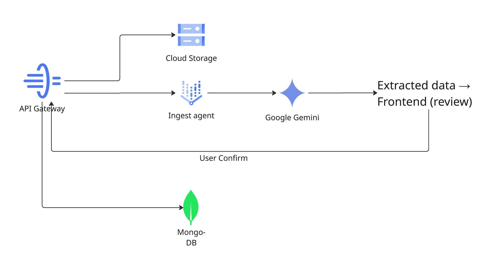

# Ingest Agent

The Ingest Agent converts raw purchase receipts — from Gmail or direct uploads — into structured purchase records. It is the entry point of the ClaimIt pipeline.

---

## Responsibilities

1. **Receipt parsing** — Extract structured purchase data from PDFs, images, and email HTML using Gemini's vision and document understanding
2. **Gmail watch** — Detect new purchase confirmation emails via Gmail `users.watch` + Pub/Sub push
3. **Confidence scoring** — Assign extraction confidence per field; low-confidence extractions trigger human confirmation
4. **Purchase persistence** — Write structured records to MongoDB and publish events to start monitoring

---

## Pub/Sub Events

| Direction | Event | Trigger |
| --- | --- | --- |
| **Subscribes** | `purchase.uploaded` | User uploads a receipt or Gmail watch detects a purchase email |
| **Publishes** | `purchase.ingested` | Structured purchase record is persisted to MongoDB |

---

## Extraction Pipeline

```
purchase.uploaded event received
    │
    ▼
Fetch receipt blob from GCS (PDF, PNG, JPEG)
    │
    ▼
Gemini vision extraction
  - Product name, platform, price paid, purchase date
  - Order ID, currency, category (retail/airline/hotel)
  - Per-field confidence scores
    │
    ▼
Confidence check (DEFAULT_CONFIDENCE_THRESHOLD = 0.95, env-overridable)
  - compute_overall_min takes the minimum confidence across material fields
  - High confidence (overall ≥ 0.95) → auto-confirm, status=monitoring
  - Low confidence (overall < 0.95) → status=pending_confirmation
  - Special rule: when a fallback product_id is used, price_paid
    confidence is capped at 0.4 to force the low-confidence path
    │
    ▼
Write Purchase document to MongoDB
    │
    ▼
Publish purchase.ingested
  - Includes: user_id, purchase_id, platform, category, status,
    ingestion_source (gmail/upload_pdf/upload_image), overall_confidence
```



### Ingestion Sources

| Source | How It Arrives | Flow |
| --- | --- | --- |
| **Gmail** | `users.watch` detects a new email matching purchase patterns → Pub/Sub push to Ingest Agent | Automatic — no user action needed after initial Gmail connection |
| **PDF upload** | User uploads a receipt PDF through the frontend | Manual — user selects file, frontend uploads to GCS, publishes `purchase.uploaded` |
| **Image upload** | User uploads a receipt photo (PNG/JPEG) | Same as PDF upload |

### Human Confirmation

When extraction confidence is low, the purchase enters `pending_confirmation` status. The frontend renders an extraction review form where the user can:

- Correct any mis-extracted fields (product name, price, date, etc.)
- Provide the product URL (optional — the Monitor Agent can auto-resolve it)
- Confirm to proceed with monitoring

On confirm, the API Gateway publishes `purchase.ingested` to start the monitoring pipeline.

---

## Gmail Watch Integration

ClaimIt uses the Gmail API's [push notification](https://developers.google.com/gmail/api/guides/push) mechanism:

1. On Gmail OAuth connection, the gateway calls `users.watch` with a Pub/Sub topic
2. Gmail pushes a notification when new mail arrives in the user's inbox
3. The Ingest Agent processes the notification, fetches the email, and checks if it looks like a purchase confirmation
4. If it matches, extraction proceeds as above

---

## Key Files

| Path | Role |
| --- | --- |
| `apps/ingest-agent/src/main.py` | Pub/Sub handler for `purchase.uploaded`, Gmail watch processing |
| `apps/ingest-agent/src/pipeline.py` | Extraction pipeline orchestration |
| `apps/ingest-agent/src/extractor.py` | Gemini-based receipt extraction |
| `apps/ingest-agent/src/classifier.py` | Receipt type classification |
| `apps/ingest-agent/src/confidence.py` | Confidence scoring — `compute_overall_min`, threshold logic |
| `apps/ingest-agent/src/dedup.py` | Receipt deduplication (SHA-256 hash) |
| `apps/ingest-agent/src/finalize.py` | Status resolution (`_resolve_status`) and purchase persistence |
| `apps/ingest-agent/src/gmail_api.py` | Gmail API client for watch and message fetch |
| `apps/ingest-agent/src/gmail_parser.py` | Email body parsing for purchase detection |
| `apps/api-gateway/src/routes/purchases.py` | Upload endpoint, GCS blob storage, `purchase.uploaded` publisher |
| `apps/api-gateway/src/services/purchases_service.py` | Confirm flow, `purchase.ingested` publisher |

---

→ Back to [Architecture](architecture.md)
